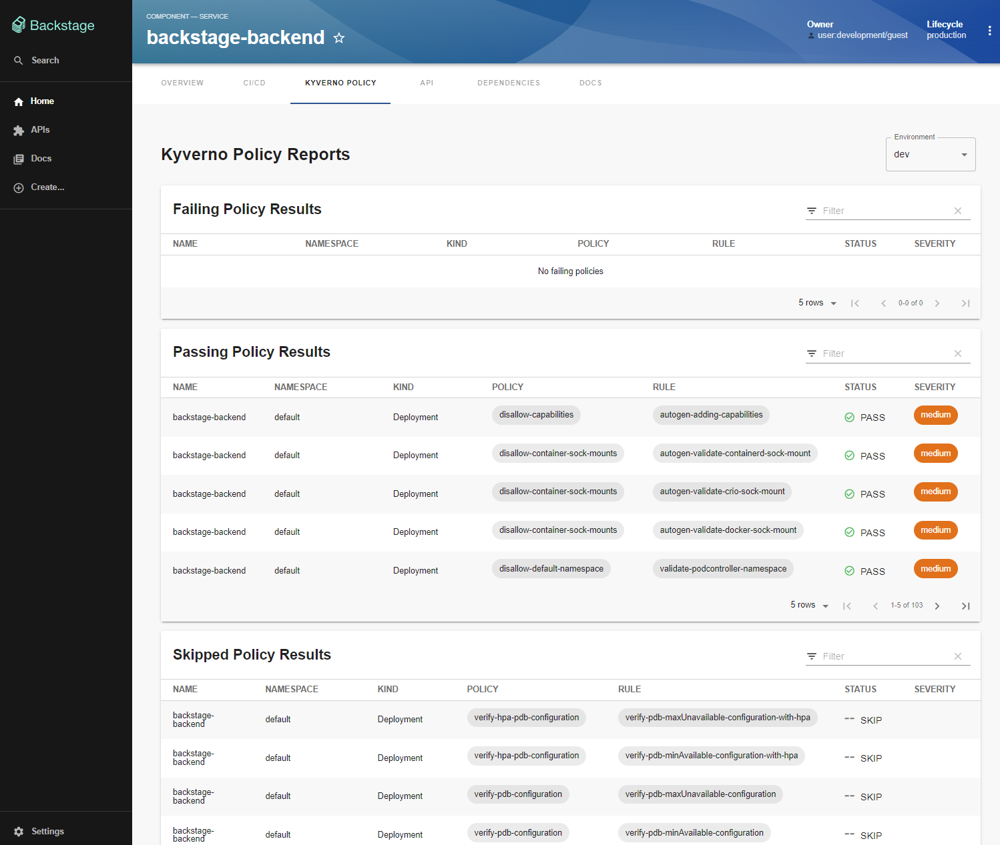

# backstage-kyverno



<!--toc:start-->

- [Description](#description)
- [Setup Backstage with Kyverno-policy-reports](#setup-backstage-with-kyverno-policy-reports)
  - [Step 1: Install packages](#step-1-install-packages)
  - [Step 2: Add the route](#step-2-add-the-route)
  - [Step 3: Add the backend plugin](#step-3-add-the-backend-plugin)
  - [Step 4: Define Kubernetes Clusters](#step-4-define-kubernetes-clusters)
  - [Step 5: Annotate Services](#step-5-annotate-services)
  - [Optional: Custom policy documentation](#optional-custom-policy-documentation)
    - [Step 1: Update the **EntityKyvernoPolicyReportsContent** component](#step-1-update-the-entitykyvernopolicyreportscontent-component)
    - [Step 2: Configure the Policy documentation](#step-2-configure-the-policy-documentation)
- [How to annotate services](#how-to-annotate-services)
- [Publishing New Versions of a Package](#publishing-new-versions-of-a-package)
  - [Step 1: Update the package.json version](#step-1-update-the-packagejson-version)
  - [Step 2: Run Yarn Install](#step-2-run-yarn-install)
  - [Step 3: Include the updated yarn.lock in the pull request](#step-3-include-the-updated-yarnlock-in-the-pull-request)
  - [Step 4: Merge the branch with main](#step-4-merge-the-branch-with-main)
  <!--toc:end-->

## Description

The Backstage-policy-reporter-plugin integrates [Policy Reporter](https://kyverno.github.io/policy-reporter/) with Backstage to provide a clear and detailed view of Kyverno Policies applied to your entities

## Setup Backstage with policy-reporter plugin

> [!NOTE]
> It's currently not possible to integrate this with a Backstage instance since the packages aren't published yet.

### Step 1: Install packages

From your backstage root directory, run the following commands:

```bash

yarn --cwd packages/app add backstage-plugin-policy-reporter
yarn --cwd packages/backend add backstage-plugin-policy-reporter-backend

```

### Step 2: Add the route

Add the **EntityKyvernoPolicyReportsContent** component to the Entity routes in `packages/app/src/components/catalog/EntityPage.tsx`

```diff

+ import { EntityKyvernoPolicyReportsContent } from 'backstage-plugin-policy-reporter';

const serviceEntityPage = (

  <EntityLayout>

    // ...

+    <EntityLayout.Route path="/kyverno" title="kyverno policy">
+      <EntityKyvernoPolicyReportsContent />
+    </EntityLayout.Route>

    // ..

  </EntityLayout>
)
```

### Step 3: Add the backend plugin

for the new backend system, add the plugin in `packages/backend/src/index.ts`

```diff

const backend = createBackend();

// ..
+backend.add(import('backstage-plugin-policy-reporter-backend'));
// ..

backend.start();

```

### Step 4: Define Kubernetes Clusters

In your Backstage instance, define your Kubernetes clusters using the `Resource` kind and `kubernetes-cluster` type. Add the `kyverno.io/endpoint` annotation with the URL to the Policy Reporter API for each cluster.

```yaml
apiVersion: backstage.io/v1alpha1
kind: Resource
metadata:
  name: aks-dev
  annotations:
    # Add the Policy Reporter API endpoint as an annotation
    kyverno.io/endpoint: http://kyverno.io/policy-reporter/api/
spec:
  type: kubernetes-cluster
```

### Step 5: Annotate Services

To show the policies on the service, add a dependency to the Kubernetes cluster resource in the `catalog-info.yaml` file of your service. Ensure that the necessary annotations are added as well. For more details, refer to the [How to annotate services](#how-to-annotate-services) section.

```yaml
metadata:
  annotations:
    kyverno.io/namespace: default # Specify the namespace of the service
    kyverno.io/kind: Deployment,Pod # Specify the kind(s) of the Kubernetes resource(s)
    kyverno.io/resource-name: policy-reporter # Specify the name of the resource
spec:
  dependsOn:
    # Add dependency to all environments the service is deployed to using the Resource entityRef
    - resource:default/aks-dev
    - resource:default/aks-tst
    - resource:default/aks-qa
    - resource:default/aks-prd
```

### Optional: Custom policy documentation

To configure the plugin to make the policy Chip a link to custom documentation, follow the steps below.

#### Step 1: Update the **EntityKyvernoPolicyReportsContent** component

To enable policy Chip links, the **EntityKyvernoPolicyReportsContent** component requires the **policyDocumentationUrl** prop to be set to the URL of the documentation.

```typescript
const serviceEntityPage = (
  <EntityLayout>
    // ...
    <EntityLayout.Route path="/kyverno" title="kyverno policy">
      <EntityKyvernoPolicyReportsContent policyDocumentationUrl="Your full URL link" />
    </EntityLayout.Route>
    // ..
  </EntityLayout>
);
```

#### Step 2: Configure the Policy documentation

The policy documentation file provided in the above step needs to follow a specific structure.

All policies being used should have a header that matches the exact same name as the policy. Under this header, you can add information about the policy and provide a guide on how to solve it.

The plugin will create a link using the following format: `<DocumentationUrl>#<PolicyName>`

See the [example/policy-documentation.md](example/policy-documentation.md) file for an example of how this could look.

## How to annotate services

To use the Kyverno-Policy-Reports plugin with your services, you need to add the following annotations to your `catalog-info.yaml`:

- `kyverno.io/namespace`: This annotation specifies the Kubernetes namespace where the service is located.
  Multiple values can be separated by a comma (e.g., `default,kyverno`)
- `kyverno.io/kind`: This annotation specifies the kind of Kubernetes resource (e.g., Deployment, StatefulSet, Pod)
  Multiple values can be separated by a comma (e.g., `Deployment,Pod`).
- `kyverno.io/resource-name`: This annotation specifies the name of the resource

```diff
metadata:
  annotations:
    # Annotations for Kyverno-Policy-Reports
+    kyverno.io/namespace: default                   # Specify the namespace(s) of the service
+    kyverno.io/kind: Deployment,Pod                 # Specify the kind(s) of the Kubernetes resource(s)
+    kyverno.io/resource-name: policy-reporter       # Specify the name of the resource
```

## Publishing New Versions of a Package

### Step 1: Update the package.json version

First, you need to update the `version` field in the `package.json` file of the package you want to update.

### Step 2: Run Yarn Install

Before creating a pull request, always run `yarn install` to ensure all dependencies are correctly installed and up-to-date.

### Step 3: Include the updated yarn.lock in the pull request

When creating a pull request, make sure to include the updated `yarn.lock` file. This file ensures that the exact same dependency tree is installed across all environments.

### Step 4: Merge the branch with main

After updating the `package.json` version, merge your branch with the `main` branch. The GitHub Actions workflow will automatically check if there's a new version and publish it.
